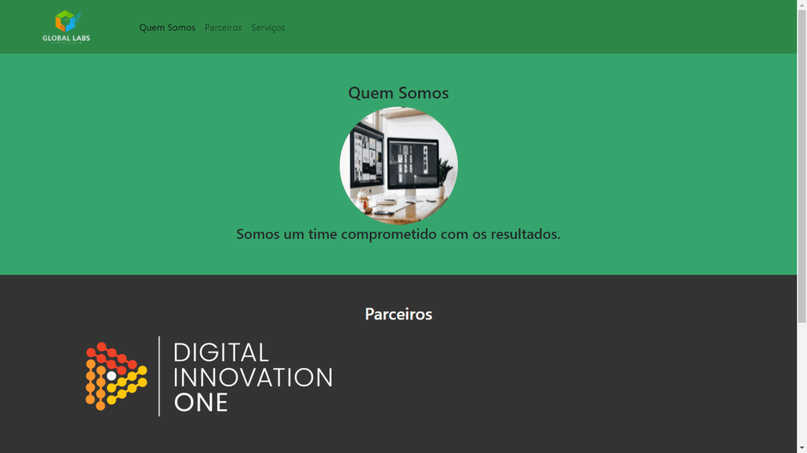

# Bootstrap - Banco Inter

> Esse repositório foi criado com o objetivo de ser destinado as práticas feitas durante o curso de bootstrap do bootcamp banco Inter.

## :camera_flash: Versão Desktop da Landing Page

## :hammer_and_wrench: Tecnologias utilizadas
 Foram utilizadas as segintes ferramentas no desenvolvimento:
 - HTML
 - CSS
 - Bootstrap
 - Markdown

## :nerd_face: Aprendizados
O que eu aprendi e coloquei em prática, com o desenvolvimento dessa landing page:
 - Divisão do html (header, nav, section e footer);
 - Aprendi a fazer um scroll suave com apenas utilizando um recurso própio do html (``scroll-behavior: smooth;``);
 - Flex-box.
 - Implementação das classes do bootstrap

## :page_facing_up: Requisitos
- Qualquer sistema operacional;
- Editor de texto :link: [VS Code](https://code.visualstudio.com/)
- Extensão para o VS Code :link: [Live Server](https://marketplace.visualstudio.com/items?itemName=ritwickdey.LiveServer)
- Browser :link: [Chrome](https://www.google.pt/intl/pt-PT/chrome/?brand=ISCS&gclid=CjwKCAiAtouOBhA6EiwA2nLKHzAVeY7vzxHKqYQHR9e2iF4Q-UYwVeNg_5CdIuPOs6RF2hbwjslc8xoCK3QQAvD_BwE&gclsrc=aw.ds)

## :pencil: Licença

